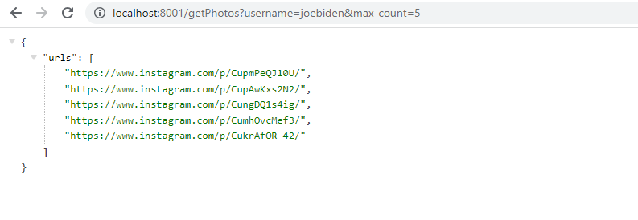

# Instagram Scraper

This is a FastAPI application that scrapes Instagram photos from a user profile using Selenium.



## Installation

1. Clone the repository:

```bash
git clone https://github.com/avmorozov2001/instagram-scraper.git
cd instagram-scraper
```

2. Install the dependencies using pip:

```bash
pip install -r requirements.txt
```

3. Update the proxy and user data directory in `routers/instagram.py`:
- Replace `your_proxy` with your desired proxy configuration or remove the proxy argument (`--proxy-server`) if not needed.
- Replace `your_user_data_dir` with the directory path where your authorized Instagram session is located.

## Usage

1. Start the application:

```bash
uvicorn main:app --host 0.0.0.0 --port 8001
```

2. Open your browser and go to `http://localhost:8000` to access the API documentation.

3. Use the `/getPhotos` API endpoint to scrape Instagram photos. Provide the `username` and `max_count` as query parameters to specify the Instagram profile to scrape and the maximum number of photos to retrieve.

4. The API response will contain the URLs of the scraped photos.